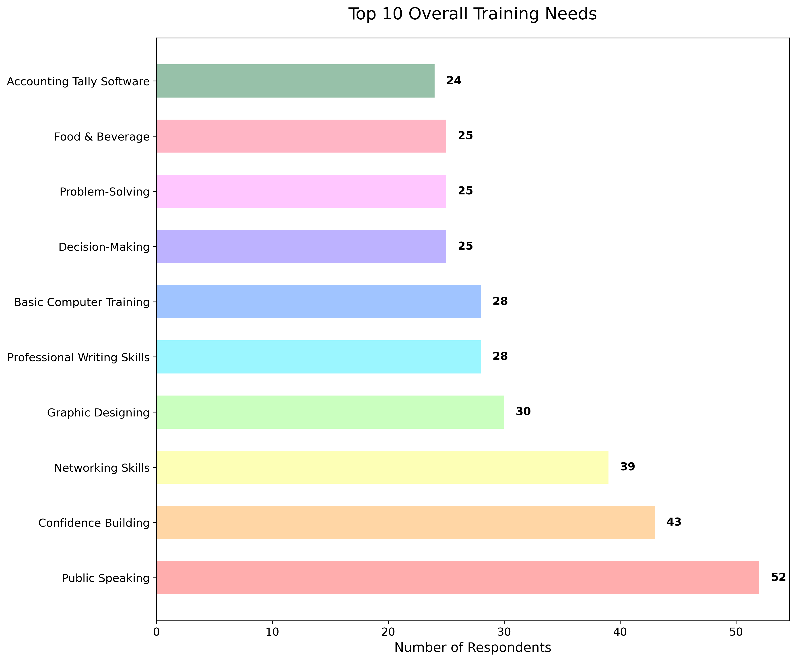

# Regional Focused Skill Training Dashboard

An interactive dashboard for analyzing regional training needs and preferences across different demographics.

🔗 **[View Live Dashboard](https://rojlap107.github.io/regional-training-dashboard/)**

## Overview

This dashboard provides an interactive way to explore regional training needs data, with filtering capabilities by region, gender, age group, and skill type. It helps identify training priorities and trends across different demographics.



## Features

- **Interactive Filtering**: Filter data by region, gender, age group, and skill type
- **Regional Analysis**: Compare skills across different regions
- **Gender Comparison**: Analyze how training needs differ between genders
- **Demographic Insights**: Visualize distribution of trainees 
- **Trainee Database**: Access detailed trainee information
- **Top Training Needs**: Identify most requested skills overall and by demographic

## Installation and Usage

### Prerequisites
- Python 3.7 or newer
- Internet connection (for initial package installation)

### Running Locally

1. Clone this repository:
   ```
   git clone https://github.com/Rojlap107/regional-training-dashboard.git
   cd regional-training-dashboard
   ```

2. Run the dashboard script:
   ```
   ./run_dashboard.sh
   ```
   
   This script will:
   - Create a virtual environment if needed
   - Install required dependencies
   - Launch the dashboard server

3. Open your web browser and go to: http://127.0.0.1:8050/

## Using the Dashboard

The dashboard includes four main tabs:

### 1. Overview Tab
- **Demographics**: Pie charts showing gender and regional distribution
- **Top Training Needs**: Bar chart of most requested skills based on your filters

### 2. Regional Analysis Tab
- **Regional Distribution of Selected Skill**: Shows how popular your selected skill is in each region
- **Top Skills by Region**: Displays the most requested skills within each region

### 3. Gender Analysis Tab
- **Gender Comparison of Training Needs**: Compare how skill preferences differ between males and females

### 4. Trainee Details Tab
- **Trainee Database**: Interactive table with detailed information about each trainee

## Customizing the Dashboard

To modify the dashboard code:

1. Edit the `dashboard.py` file using a text editor or Python IDE
2. Restart the dashboard after making changes by stopping the current process (Ctrl+C) and running `./run_dashboard.sh` again

## Data Sources

This dashboard uses survey data collected from different regional settlements, analyzing training needs and preferences across various demographics.

## License

MIT License

## Acknowledgements

- Dash and Plotly for visualization components
- Pandas for data processing
- Bootstrap for styling enhancements